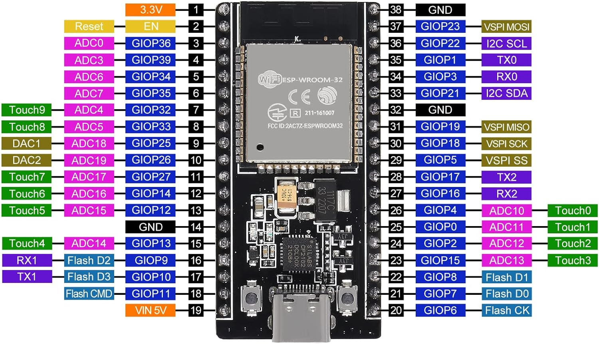

# HomeKit Garage Door Control Switch

An ESP32-based HomeKit accessory for remotely opening and closing your garage door. Works with iPhone and Apple CarPlay. Includes custom 3D-printed housings and servo mountings.

## Features
- Native HomeKit support via ESP32
- Custom 3D-printed enclosure
- Simple servo-driven mechanism
- Secure mounting system

## Hardware
- ESP32 Dev Board
- Micro Servo (Tower Pro SG90)
- 3D-printed enclosure and mount

## Files
- `/garageDoorCode`: Arduino code
- `/hardware`: 3D models for printing and wiring diagrams
- `/servo_model`: Servo 3D model reference

## Wiring

## Assembly
1. Print the enclosure and mount.
2. Install the servo motor.
3. Flash the ESP32 with `garageDoorCode.ino`.
4. Connect and mount the system.
5. Add to HomeKit.
